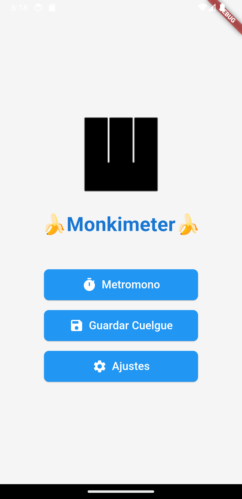
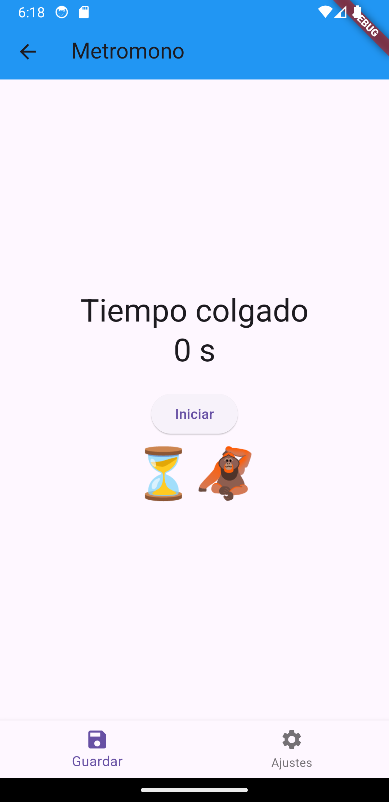
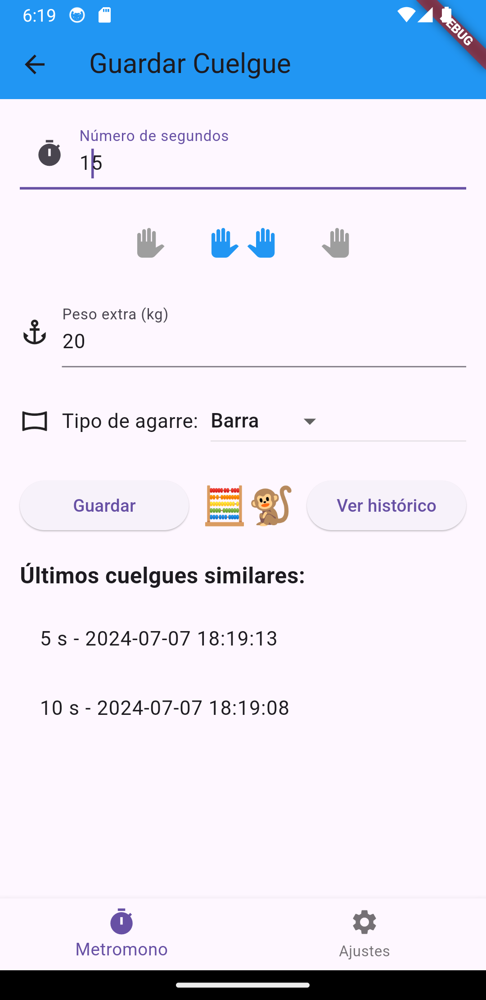

# 🐵 Monkimeter 🐵


Monkimeter es una aplicación móvil desarrollada en Flutter que te permite registrar y controlar tus entrenamientos de escalada en hangboard.

## Características

- Registra tus cuelgues para entrenamiento en hangboard.
- El contador configurable muestra y narra la duración de tu cuelgue.
- Puedes revisar tu histórico y añadir nuevos tipos de agarres.

## Requisitos previos

Antes de comenzar, asegúrate de tener instalado:

- [Flutter](https://flutter.dev/docs/get-started/install)
- Un IDE compatible. Recomiendo [VS Code](https://code.visualstudio.com/) y [Android Studio](https://developer.android.com/studio) por si quieres emular un dispositivo.

## Instalación

1. Clona este repositorio:
   ```sh
   git clone https://github.com/tu-usuario/monkimeter.git

   ```

2. Navega al directorio del proyecto:
   ```
   cd monkimeter
   ```

3. Instala las dependencias:
   ```
   flutter pub get
   ```

## Uso

Para ejecutar la aplicación en modo de desarrollo:

```
flutter run
```

## Estructura del proyecto

- `lib/`: Contiene el código fuente de la aplicación
- `assets/`: Incluye recursos como imágenes, fuentes, etc.
- `pubspec.yaml`: Archivo de configuración de Flutter y dependencias

## Capturas de pantalla

<p align="center">
  
  
  
</p>

## P.D:

Este ha sido un proyecto rápido para entretenerme y aprender un poco de Dart. Por favor, no tengas en cuenta los errores y malas prácticas que habré cometido 🙏
Las contribuciones son bienvenidas. Por favor, abre un issue si lo consideras y seguro que tu mejora será apreciada.